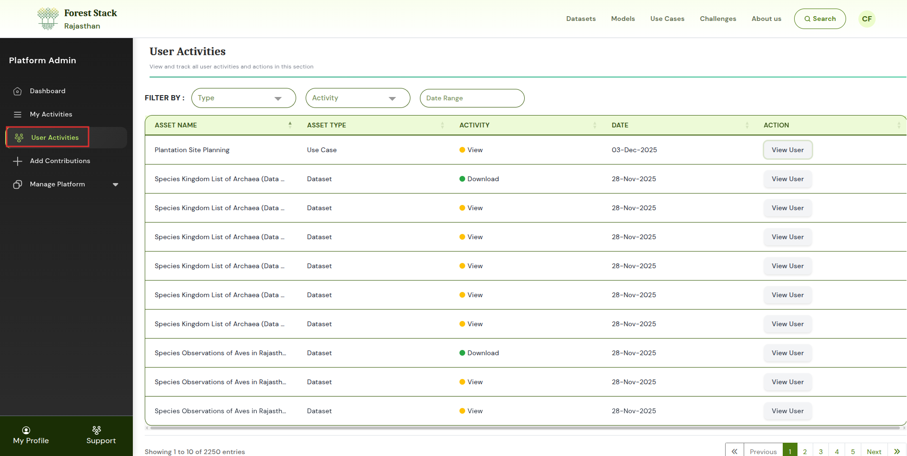
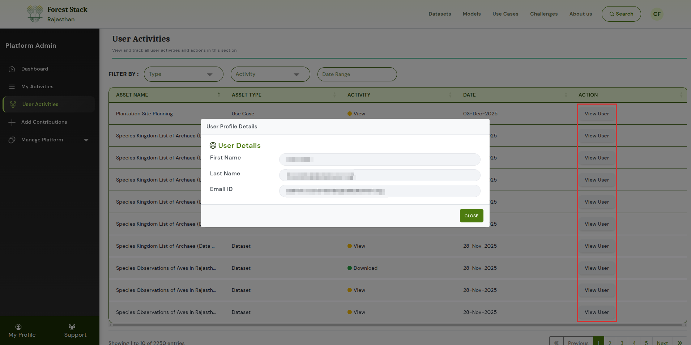
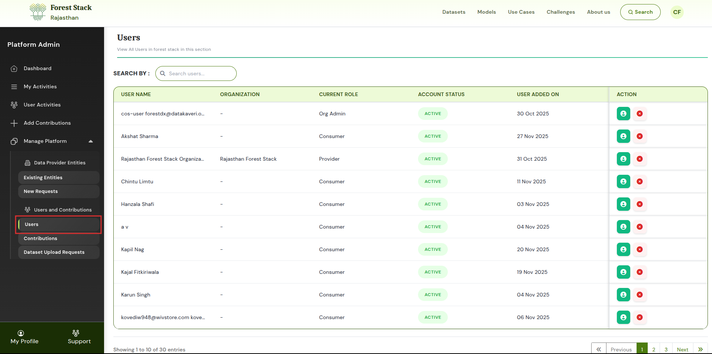

# User Management

Forest Stack provides platform administrators with two key areas to monitor user activity and oversee user participation:

1. **User Activities** – Track how users interact with datasets, models, and use cases.
2. **Manage Platform → Users and Contributions → Users** – View and manage user accounts and their access status.

Together, these tools give administrators full visibility into user actions and allow them to maintain secure, well-governed user access.

---

## User Activities

The **User Activities** tab offers a detailed log of all user interactions with assets across Forest Stack. Administrators can view the following information:

- **Asset Name**: The name of the dataset, model, or use case the user interacted with.
- **Asset Type**: Indicates the category of the asset (Dataset, Model, or Use Case).
- **Activity**: (Viewed, Downloaded) Shows what action the user performed on the asset.
- **Date**: The exact date and time the action was recorded.
- **Action → View User**: Allows the admin to view details of the user who performed the activity.

  
*User Activities*

Selecting **View User** under the *Action* column displays user details such as:

* **First Name**: The first name of the user who performed the activity.
* **Last Name**: The last name of the user associated with the activity.
* **Email ID**: The registered email address of the user.

  
*View User*

This helps administrators identify which user performed a specific action on an asset.

---

## Manage Platform → Users and Contributions → Users

Within the **Users** section, administrators can view essential information about all registered users, including:

* **Username**: The registered username of the user on Forest Stack.
* **Organisation**: The Data Provider Entity the user is affiliated with, if any.
* **Current Role**: The user’s assigned role such as Consumer, Provider, or Organisation Manager.
* **Account Status**: Indicates whether the user’s account is active or deactivated.
* **User Added On**: The date the user account was created on the platform.
* **Action**: Action tab for admin to view, activate or deactivate a user.

### Admin Actions

Administrators can also perform the following account-related actions:

* **View User** – Displays detailed information about the selected user.
* **Activate a User** – Enables the user’s account, granting access to the platform.
* **Deactivate a User** – Disables the user’s account, preventing further access.

  
*Users*

---

These controls help maintain secure access and ensure that only authorized users have active accounts on the platform.

