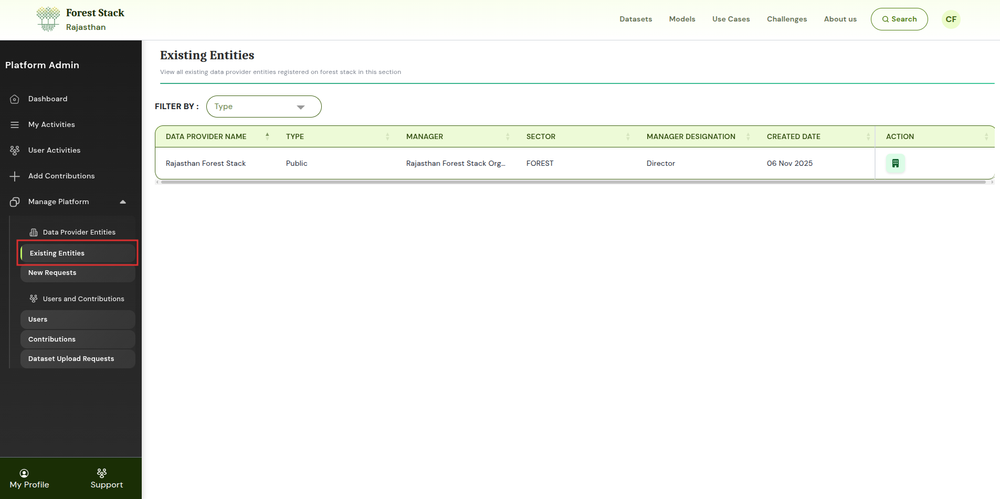
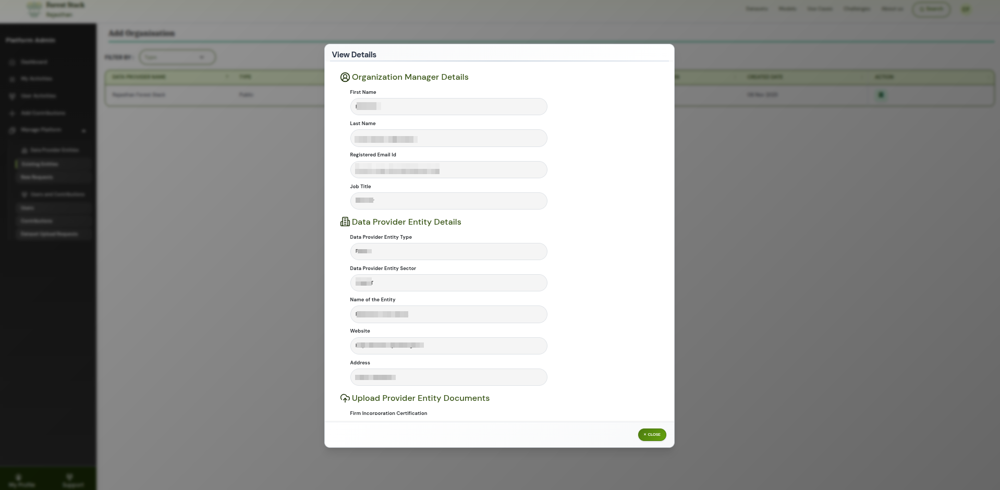
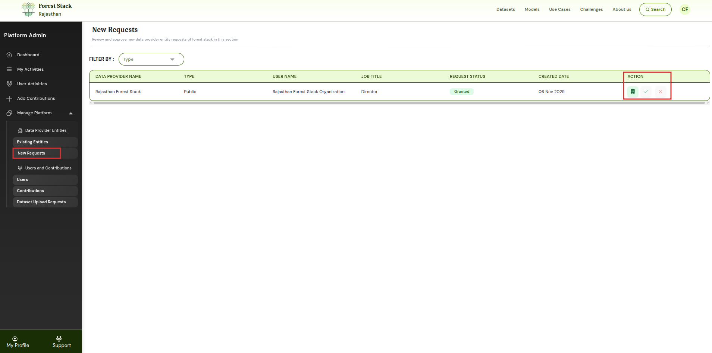

# Organisation Management

Platform administrators are responsible for managing all **Data Provider Entities** within Forest Stack. This includes reviewing new organisation requests, verifying details, and maintaining information for all existing entities. These controls ensure that only verified and authorised organisations contribute assets to the platform.

---

## Manage Platform → Data Provider Entities

The **Data Provider Entities** section is divided into two parts:

1. **Existing Entities** – Lists all currently registered Data Provider Entities along with their details and management options.
2. **New Requests** – Shows pending organisation registration requests awaiting admin review and approval.

---

## 1. Existing Entities

In the **Existing Entities** tab, platform administrators can view the complete list of organisations already registered on Forest Stack. For each Data Provider Entity, the table displays:

* **Data Provider Name** – The official name of the registered Data Provider Entity.
* **Type** (Public, Private, Academic, etc.) – Indicates the category or nature of the organisation.
* **Manager** – The name of the Organisation Manager responsible for the entity.
* **Sector** – The domain or industry the organisation belongs to.
* **Manager Designation** – The official job title of the Organisation Manager.
* **Created Date** – The date the Data Provider Entity was registered on the platform.
* **Action** – Provides options to view organisation manager details, data provider entity details, and uploaded documents.

  
*Existing Entities*

### Action Options

Under the **Action** column, the platform admin can:

* **View Organisation Manager Details** – Opens detailed information about the Organisation Manager associated with the entity.
* **View Data Provider Entity Details** – Displays the full profile and metadata of the Data Provider Entity.
* **View or Download Uploaded Organisation Documents** – Allows the admin to access or download the documents submitted during organisation registration.

This helps maintain clarity around organisational ownership, roles, and compliance.

  
*Action Tab*

---

## 2. New Requests

The **New Requests** tab allows the platform admin to review and approve new Data Provider Entity submissions.

* **Data Provider Name** – The name of the organisation requesting to be added to Forest Stack.
* **Type** – Specifies the organisation’s category (Public, Private, Academic, etc.).
* **Username** (requesting user) – The user who submitted the organisation registration request.
* **Job Title** – The requester’s official designation within the organisation.
* **Request Status** – Indicates whether the request is pending, approved, or rejected.
* **Created Date** – The date the organisation request was submitted.
* **Action** – Options for the admin to view details, approve, or reject the request.

### Action Options

For each request, administrators can:

* **View Data Provider Entity Details** – Opens the full information submitted for the new organisation request.
* **Approve the Request** – Confirms and registers the organisation as a Data Provider Entity on the platform.
* **Reject the Request** – Declines the submission and prevents the organisation from being added.

  
*Action Options in New Requests*

This ensures that only legitimate and validated organisations are added to Forest Stack.

---

Through these controls, platform administrators ensure secure onboarding and management of all Data Provider Entities within Forest Stack.
