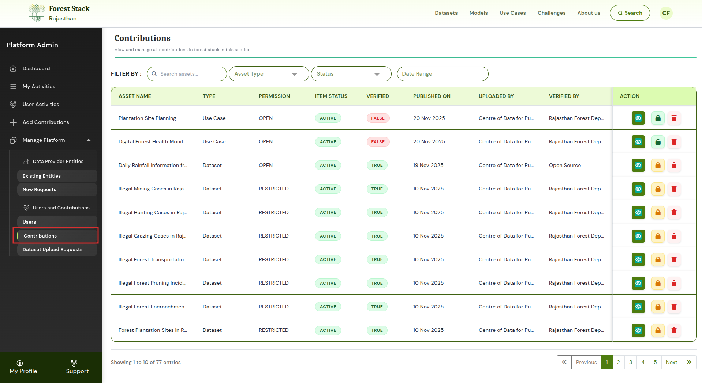
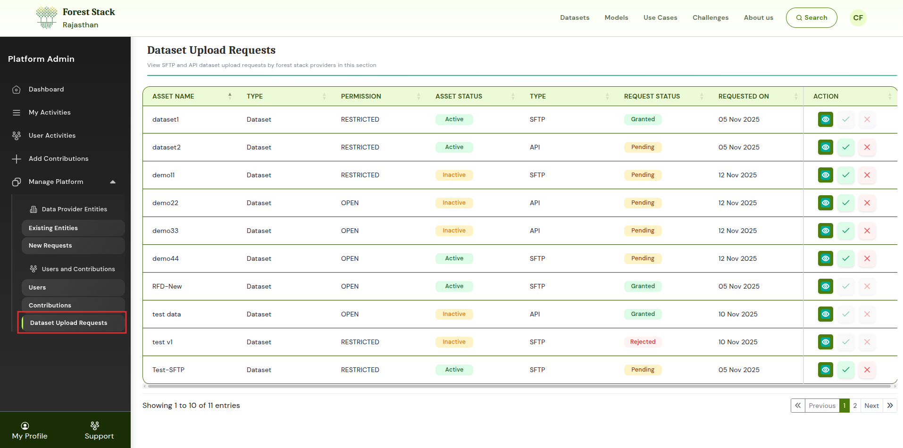

# Asset Management

Platform administrators oversee all assets contributed to Forest Stack. Through the management tools available under **Manage Platform → Users and Contributions**, admins can review, verify, update, and moderate datasets, models, and use cases submitted by Providers.

---

## Manage Platform → Users and Contributions → Contributions

In the **Contributions** section, platform admins can view and manage every asset uploaded to Forest Stack. The contributions table provides key information, including:

* **Asset Name** – The title of the dataset submitted for upload.
* **Asset Type** – Indicates whether the submission is a Dataset, Model, or other supported asset.
* **Permission** (Open, Restricted) – Defines whether users can download the asset freely or only after approval.
* **Item Status** (Active, Inactive) – Shows whether the asset is currently active on the platform or not.
* **Verified**(True,False) – Indicates whether the asset has been reviewed and approved by the Organisation Manager or platform administrator for publication
* **Published On** – The date when the provider initiated the upload request.
* **Uploaded By** – Shows the name of the user or organisation that submitted the asset to Forest Stack.
* **Verified By** – Displays the name of the administrator or Organisation Manager who reviewed and approved the asset.
* **Action** – Options for the admin to view and update asset details, hide/unhide the asset, and delete the asset.

### Actions Available

Under the **Action** column, platform administrators can:

* **View & Edit Asset Details** – Allows the admin to review and modify the metadata and settings of the selected asset.
* **Hide / Unhide an Asset from the Platform** – Controls whether an asset is visible or hidden from end users.
* **Delete an Asset from Forest Stack** – Permanently removes the asset and its associated content from the platform.

These controls help ensure that only accurate, compliant, and approved assets remain visible to users.

  
*Contributions*

---

## Manage Platform → Users and Contributions → Dataset Upload Requests

The **Dataset Upload Requests** section allows platform admins to review requests from Providers who upload datasets via **SFTP** or **API**.

Each request in the table displays:

- **Asset Name**: The title of the dataset submitted for upload.
- **Type**: Indicates whether the submission is a Dataset, Model, or other supported asset.
- **Permission**: (Open, Restricted) Defines whether users can download the asset freely or only after approval.
- **Asset Status**: (Active, Inactive) Shows whether the asset is currently active on the platform or not.
- **Type**: (SFTP, API) Specifies the method used by the provider to submit the dataset.
- **Request Status**: (Granted, Pending, Rejected) Displays the current approval state of the upload request.
- **Requested On**: The date when the provider initiated the upload request.
- **Action**: Options for the admin to view details, approve, or reject the request.

### Actions Available

In the **Action** column, admins can:

* **View Details of the Upload Request** – Opens the full submission information, including metadata and upload method.
* **Approve the Dataset Upload** – Accepts the submission, allowing the dataset to proceed to publishing.
* **Reject the Request** – Declines the upload submission and prevents the dataset from being added to the platform.

This ensures that all SFTP/API dataset uploads are validated before being published on Forest Stack.

  
*Dataset Upload Requests*

---

Through these tools, platform administrators maintain quality, transparency, and control over all assets contributed to Forest Stack.
