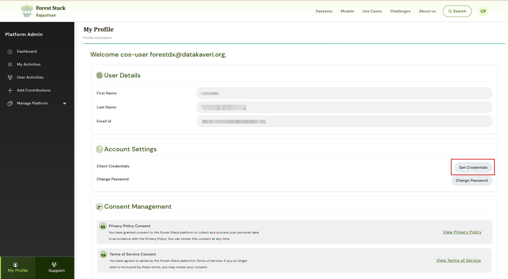

## Introduction

The Dataset Access API allows external systems to retrieve dataset metadata, query structured information, access the latest records, and download dataset files. It is designed for automated, scalable, and reliable machine-to-machine integration.

### What the API Does

* Retrieves dataset metadata such as title, description, provider, tags, and update history
* Fetches full dataset content or filtered subsets
* Returns the most recent dataset entries
* Allows downloading dataset files in supported formats

### Who Should Use It

* Developers integrating datasets into applications
* Data analysts and scientists automating ingestion workflows
* AI/ML teams requiring structured datasets for modelling
* Government dashboards and enterprises needing scheduled data refresh
* Automation systems performing periodic or event-driven access

### How It Relates to Forest Stack Datasets

Every dataset, Open or Restricted has a corresponding API endpoint. APIs provide:

* Faster automated access
* Structured and consistent output
* Support for batch, scheduled, or real-time processing

---

## Access Requirements

### API Keys (Client Credentials)

To use Forest Stack APIs, users must generate **Client Credentials**:

**My Profile → Account Settings → Client Credentials**

Roles determine dataset access:

* **Consumers** → Access Open datasets
* **Providers** → Access datasets they upload
* **Organisation Managers** → Access organisation datasets
* **Platform Administrators** → Full access

### Open vs Restricted Datasets

* **Open datasets** → Accessible immediately
* **Restricted datasets** → Require approval

---

## Authentication Flow

Before calling any dataset API, users must generate an authentication token.

### Step 1: Generate Client Credentials

From the user dashboard:

1. Go to *My Profile → Account Settings*
2. Select **Client Credentials**
3. Generate a **Client ID** and **Client Secret**

  
*Click on **Get Credentials** to download the credentials*


### Step 2: Request an Authentication Token

Use the client ID and secret to request a token:

````
curl --location --request POST "https://controlplane.forest-stack.digivan.forest.rajasthan.gov.in/iudx/v2/auth/token"
--header "clientId: <CLIENT_ID>"
--header "clientSecret: <CLIENT_SECRET>"
````

A valid token must be included in the `Authorization` header for all API requests.

### Optional params During Token Generation

| Key              | Location    | Purpose                                                 |
|------------------|-------------|---------------------------------------------------------|
| **delegationId** | Header      | Used only for delegated access requests                 |
| **itemId**       | RequestBody | Required when requesting dataset-specific access tokens |

---

---

## Available Dataset APIs

### 1. List Datasets

Retrieve available datasets with optional filters.

````
curl "https://controlplane.forest-stack.digivan.forest.rajasthan.gov.in/iudx/v2/cat/search?sort=name:asc;itemCreatedAt:asc;&page=1&size=10000"
-H "Authorization: Bearer <YOUR_ACCESS_TOKEN>"
-H "Content-Type: application/json"
--data '{
"searchCriteria": [
{
"searchType": "term",
"field": "type",
"values": ["adex:DataBank"]
}
]
}'
````

---

### 2. Get Dataset Metadata

Fetch detailed metadata for a dataset.

````
ITEM_ID="<item-id-here>"

curl "https://controlplane.forest-stack.digivan.forest.rajasthan.gov.in/iudx/v2/cat/item?id=$ITEM_ID"
-H "Authorization: Bearer <YOUR_ACCESS_TOKEN>"
-H "Accept: application/json"
````

---

### 3. Query Dataset Records

Query structured data using search filters.

````
curl "https://controlplane.forest-stack.digivan.forest.rajasthan.gov.in/iudx/v2/cat/search?sort=name:asc;itemCreatedAt:asc;&page=1&size=10000"
-H "Authorization: Bearer <YOUR_ACCESS_TOKEN>"
-H "Content-Type: application/json"
--data '{
"searchCriteria": [
{
"searchType": "term",
"field": "type",
"values": ["adex:DataBank"]
},
{
"searchType": "term",
"field": "tags",
"values": ["rajasthan", "species"]
}
]
}'
````

More API endpoint can be found [here](https://controlplane.forest-stack.digivan.forest.rajasthan.gov.in/apis)

---
