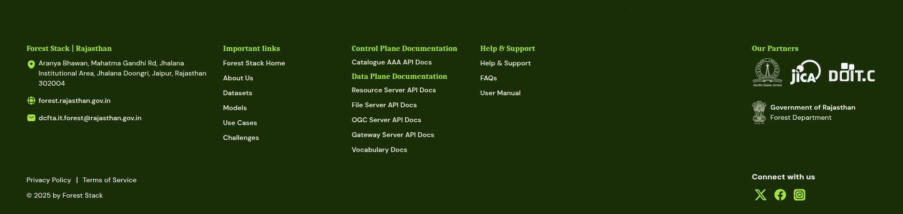

## Footer

The footer reinforces the platform’s identity with quick navigation links:

- **Important Links:** Forest Stack Home, About Us, Datasets, Models, Use Cases, Challenges  
- **Control Plane Documentation:** Catalogue AAA API Docs
- **Data Plane Documentation:** Resource Server API Docs ,File Server API Docs, OGC Server API Docs, Gateway Server API Docs, Vocabulary Docs
- **Help & Support:** FAQ, User Manuals

It also includes:
- **Social media icons**: X, Facebook, Instagram
- **Legal links**: Privacy Policy and Terms of Service
- **Our Partners**: Logos of partner organization

  
*Footer section*
