# Datasets

It is a rich repository of forest-related data enabling holistic insights, policy development, and tech-driven solutions for sustainable forest management and biodiversity preservation.

---

### Datasets Listing Page

The Dataset Listing page offers a consolidated view of all available Datasets, complete with a search bar, sorting options and a collapsible filter panel (by Concepts, Tags, File Format, Access Permissions, and more) to help users pinpoint relevant assets. Each Dataset is presented as a card showing its title, provider, permission and a brief description, along with other relevant metadata; clicking on the dataset card opens the full details or download options.

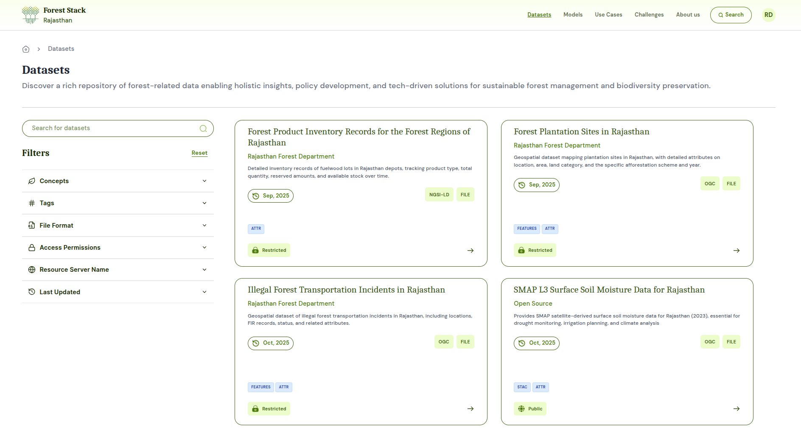
_Datasets Listing Page_

### Datasets Search Bar
Positioned at the top of the Dataset Listing page, the search bar lets users enter keywords to quickly locate specific Datasets. As users type, it offers instant suggestions and filters the displayed cards to match titles, descriptions or tags, streamlining the discovery process.
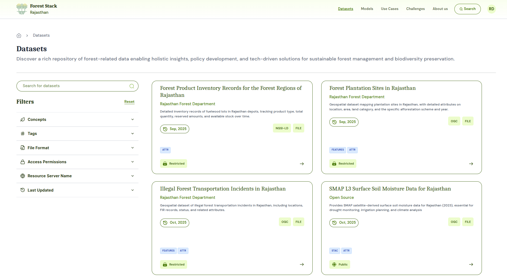
_Datasets Search Bar_

### Filter Feature
The filter panel is divided into several sections, each allowing users to narrow the Dataset listing according to specific criteria:
- Tags: Custom keywords you add to highlight important or unique aspects of your dataset. They act as search terms that help users quickly discover your content.
- Concepts : Standardized domain categories you choose to classify your dataset into broader thematic areas, making it easier for users to browse and understand the dataset’s domain.
- File Format: Choose from formats like CSV, PDF, TXT, Shapefile, image files etc. Selecting multiple types returns any Dataset offering at least one of the chosen formats.
- Access Permission:
  - Open: Publicly available Datasets with immediate download access.
  - Restricted: Datasets requiring approval or elevated permissions to download.

- Resource Server Name: Name of the resource server Dataset belongs to like OGC,FILE,NGSI-LD, FILE.
- Last Updated: Restrict results to Datasets updated in last 7 days, last 30 days, last 1 year.

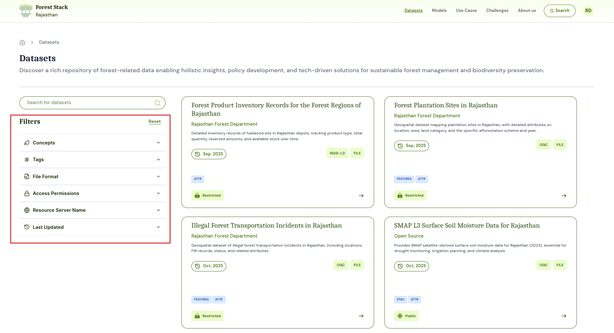
_Filter Feature_

### Dataset Card
Each Dataset card provides a snapshot of key information:
- **Title**
- **Publishing Data Provider Entity**
- **Short description**
- **Resource Server Name**
- **Last updated date**
- **Action Button: “Right Arrow” to open the full details and download options**

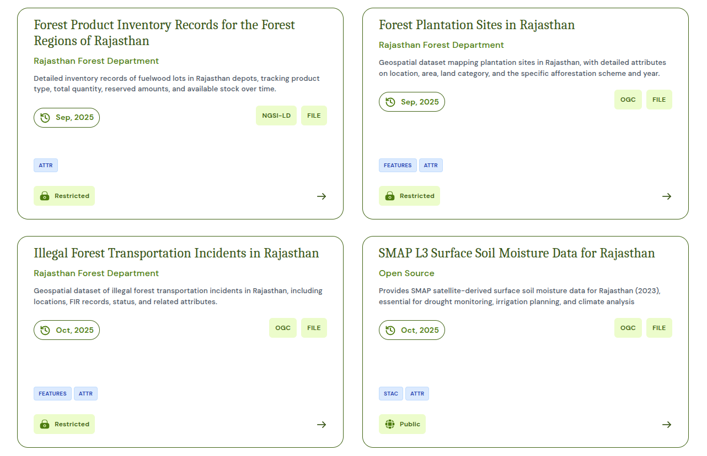
_Dataset Card_

---

## Dataset Details

1. **<u>Metadata:</u>** Each Dataset comprises a comprehensive metadata panel that describes the asset's origin, usage scope, access rules, and quality indicators. This information helps users assess relevance and technical suitability before downloading or integrating the dataset into their projects.

*Metadata fields shown are:*
- **Title**: Name of the dataset
- **Short Description**: A one- or two-sentence summary of the Dataset’s content and purpose.
- **Tags**: Add tags (e.g., "Community Health," "Satellite Imagery") to aid discovery.
- **Long description**: The long description section provides an in-depth narrative about the Dataset, offering context that goes beyond the basic metadata fields. It can outline the type of records (e.g., antenatal visit history, diagnostic results, vital signs) and the data sources (such as public health centers or hospitals). It can also suggest potential use cases, ideal audience and indicate on type on possible analyses that can be performed using the dataset.
- **Uploaded By**: The user or team (or their organisation) that submitted the DataSet to Forest Stack.
- **Organization Type**: Public or Private
- **Industry**: The sector classification such as, healthcare, mobility, etc. that indicates the Dataset’s primary domain.
- **Geo Coverage**: The geographic extent of the data (e.g., “State-level (Rajasthan)”).
- **Year Range**: The temporal span of the records contained in the data bank (e.g., 2018–2024).
- **License**: The legal terms under which the Dataset is made available (e.g., Rajasthan  Open Health Data License v1.0).
- **Data Provider Entity**: The government department, agency or entity that has the ownership of the published Dataset.
- **Last Updated**: Date and time when the Dataset was most recently refreshed.
- **File Format**: The downloadable format(s) provided (e.g., CSV, TXT, PDF).
- **Upload Frequency**: How often the Dataset is updated (e.g., Quarterly, Monthly, One-time).
- **Verified By**: The role or individual—typically the Organisation Manager—who reviewed and approved the Data Bank for publication.

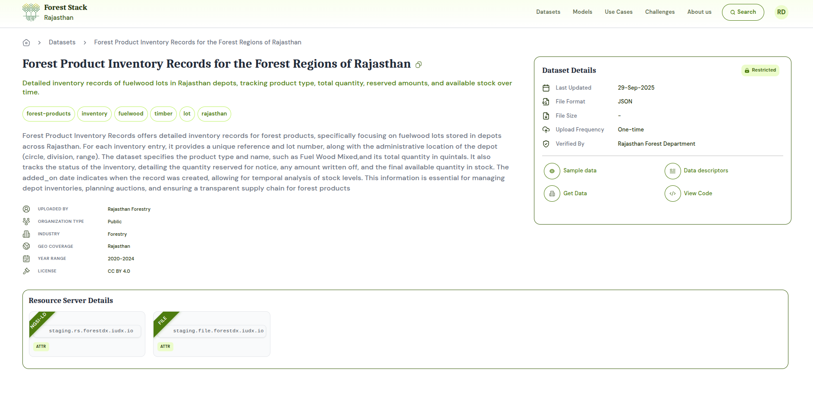
_Dataset Details_

2. **<u>Data Querying:</u>**
- Get Data
- Get Latest Data
- Query Data
- Download Data

---

## Dataset Upload

### Step 1: Click on **Add Contributions** and then select **Add Dataset** to set up your dataset:
1. **Enter Title & Permission:**
   - **Dataset Title**: Give your dataset a clear, descriptive name.
   - **Dataset Permission**: Choose from following in the drop-down:
     - Open: Viewable/downloadable by all registered users
     - Restricted: Users can view Dataset but downloadable only upon publisher’s approval
2. **Choose Metadata Entry Method:**
   - **Enter Metadata Manually:** Click ‘Enter Metadata’ to fill in all fields via the form.
   - **Import from JSON:** Click ‘Upload JSON File’ to upload your metadata using an existing template file

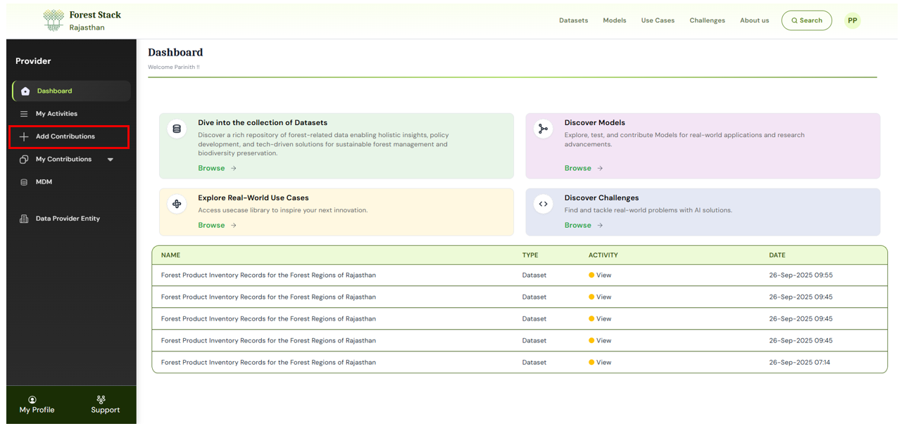
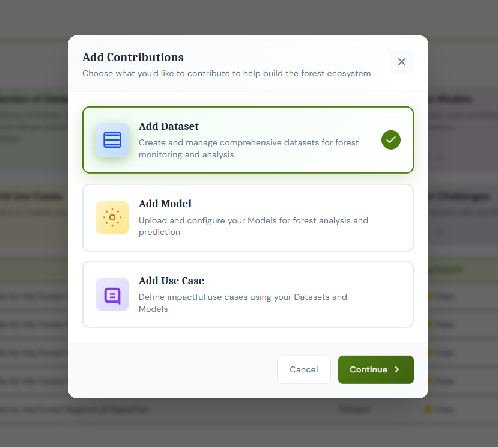
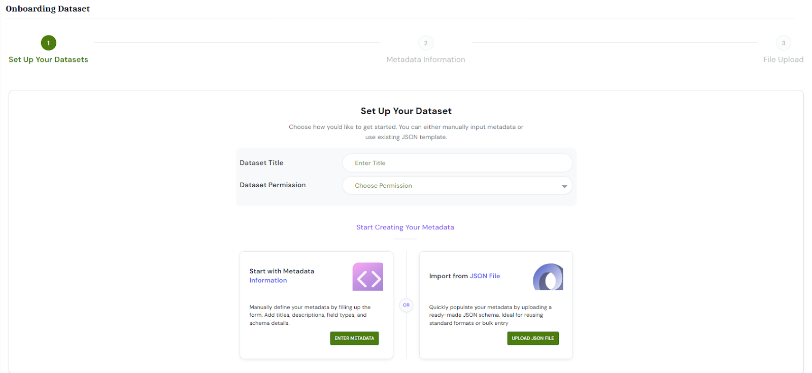
_Set up your dataset_

### Step 2: Enter Metadata Information
1. Under metadata Information, fill out each mandatory field:
   - **Short Description**: A one- or two-sentence summary of the Dataset’s content and purpose.
   - **Tags**: Add tags (e.g., "Community Health," "Satellite Imagery") to aid discovery.
   - **Long Description**: Provide an in-depth narrative about the Dataset, offering context that goes beyond the basic metadata fields. It can outline the type of records (e.g., antenatal visit history, diagnostic results, vital signs) and the data sources (such as public health centers or hospitals). It can also suggest potential use cases, ideal audience and indicate on type on possible analyses that can be performed using the Dataset.
   - **License**: Legal terms governing reuse.
   - **Resource Server**: Select the resource server from the dropdown.
   - **Geo Coverage**: Geographic extent (e.g., State-level Rajasthan).
   - **Upload Frequency**: How often the data will be updated (Daily, Weekly, Monthly, Annually, One-time).
   - **Year Range**: The temporal span of the records contained in the data bank (e.g., 2018–2024).
   - **Concepts**: Predefined domain categories used to classify your dataset into broader thematic areas for easier browsing.Choose appropriate from the drop down.
   - **Dataset Type**: Choose from catalogued types – structured/semi-structured/unstructured.
   - **File Format**: Format of data bank file which is being uploaded (CSV, TXT, PDF, GeoJSON, Shapefile, etc.).
   - **Sample Data**: Upload a sample data file.
   - **Attribute Name**: Give the name of the attribute.
   - **Parameter Type**: Choose the type from the drop down (e.g.: ValueDescriptor, Time Series Aggregation, Relationship Value)
   - **Schema Type**: Choose the data type of the attribute (e.g.: Number, Text, Point etc)
   - **Upload or Redirect Link**: Choose upload files or choose redirect url and paster the url.
2. **Link Related Assets**: Add Associated Datasets or Add Associated Models to create pre-defined connections between your new Dataset and other platform content.

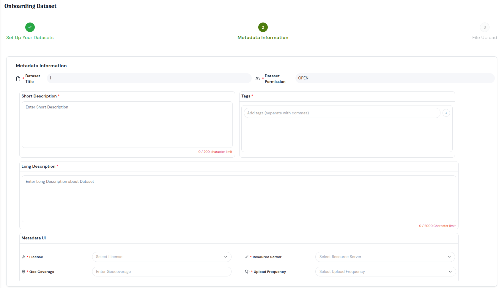
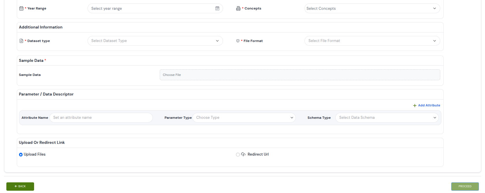
_Adding metadata information_

### Step 3: Upload Dataset
The user should upload the relevant files according to the file format selected in Step 2. Users can upload multiple files using the "Upload More" button. Additionally, users can clear or delete any previously uploaded files and upload new files or an entirely new set using the **Clear All** button.
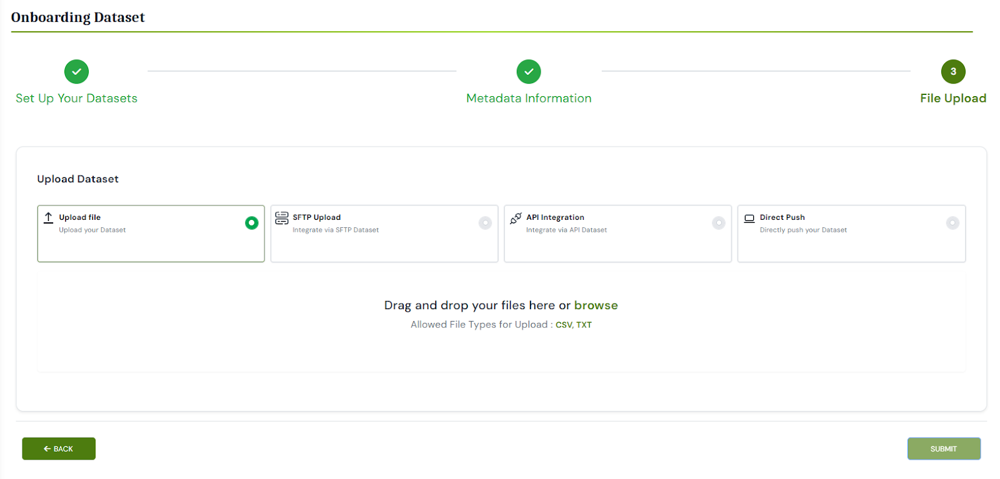

### Step 4: Review and Publish
After your files finish uploading, you’ll be taken to a summary page displaying all metadata fields and tags you entered, list of uploaded files and their preview (if uploaded data is structured). Carefully verify each detail—move back to the respective section to correct any information. When everything looks correct, click Publish.

### Step 5: Approval
Approval requests are sent to the Organisation Manager for review. Once they approve, the Dataset gets published on the Forest Stack Dataset listing page.

---

## Dataset Download

Depending on a Dataset's permission level, the steps to download differ slightly:

- **Open Datasets:**
  1. Click the **Download** button on the Dataset details page.
  2. The entire Data Bank (all files and folders) is packaged into a single ZIP archive and begins downloading immediately
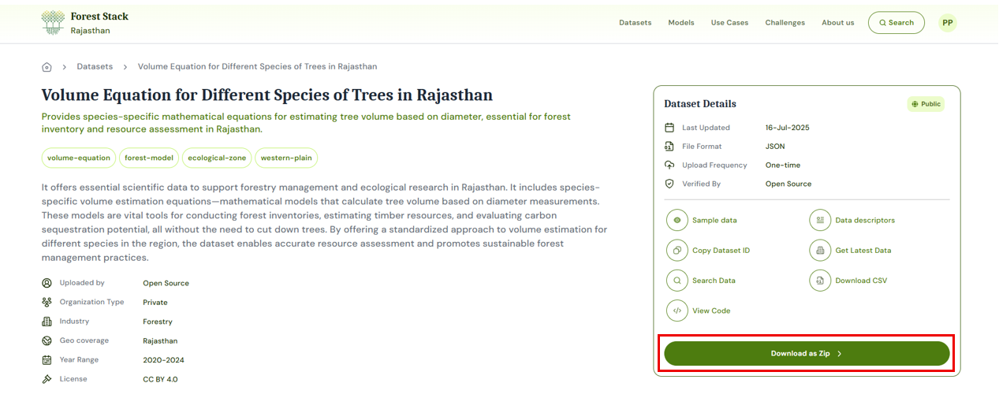
_Downloading Open Datasets_

- **Restricted Datasets:**
  1. Click the **Request Access** button on the data bank details page
  2. A request form pops up; add a brief justification for why you need access.
  3. Submit the request—Forest Stack notifies the Dataset's publisher
  4. Once approved, you'll receive an email notification, and a **Download** button appears in the details page.
  5. Click **Download** to retrieve the full Dataset.
  
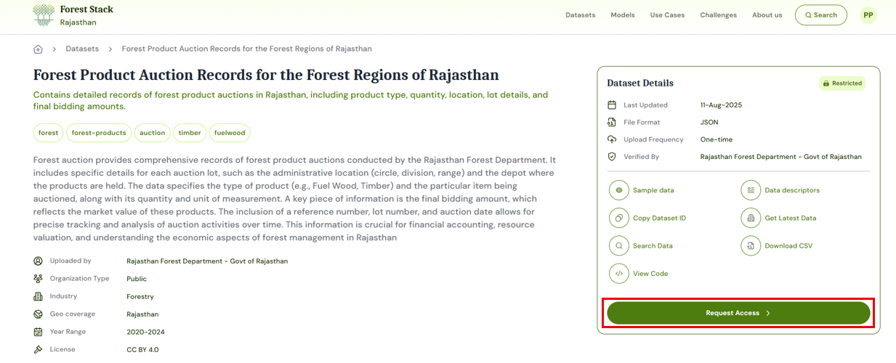
_Downloading Restricted Datasets_

---
