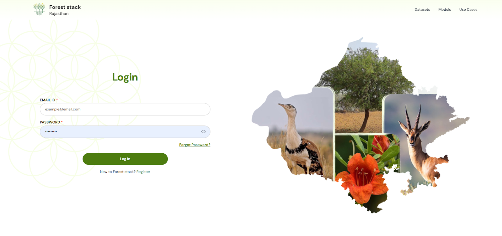
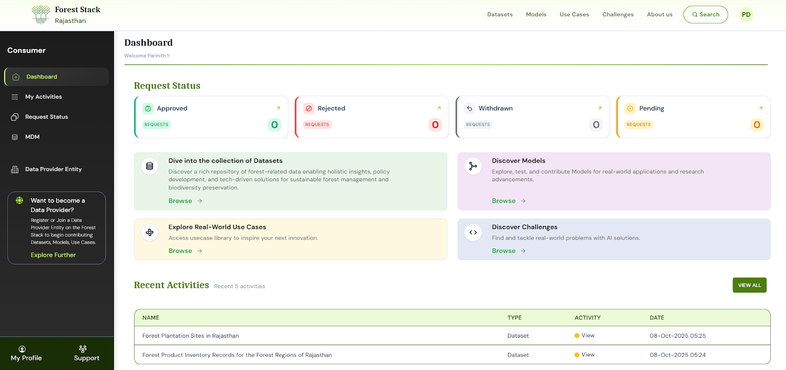

**Step 1:** Click **Login/Register** on the Home Page.  

  
*Clicking on Login/Register button*

**Step 2:** Enter your email address and password.

  
*Form for Logging In*

**Step 3:** Access your dashboard — once verified, you’ll be redirected to the dashboard for your assigned role.  

  
*Post-login consumer dashboard*
